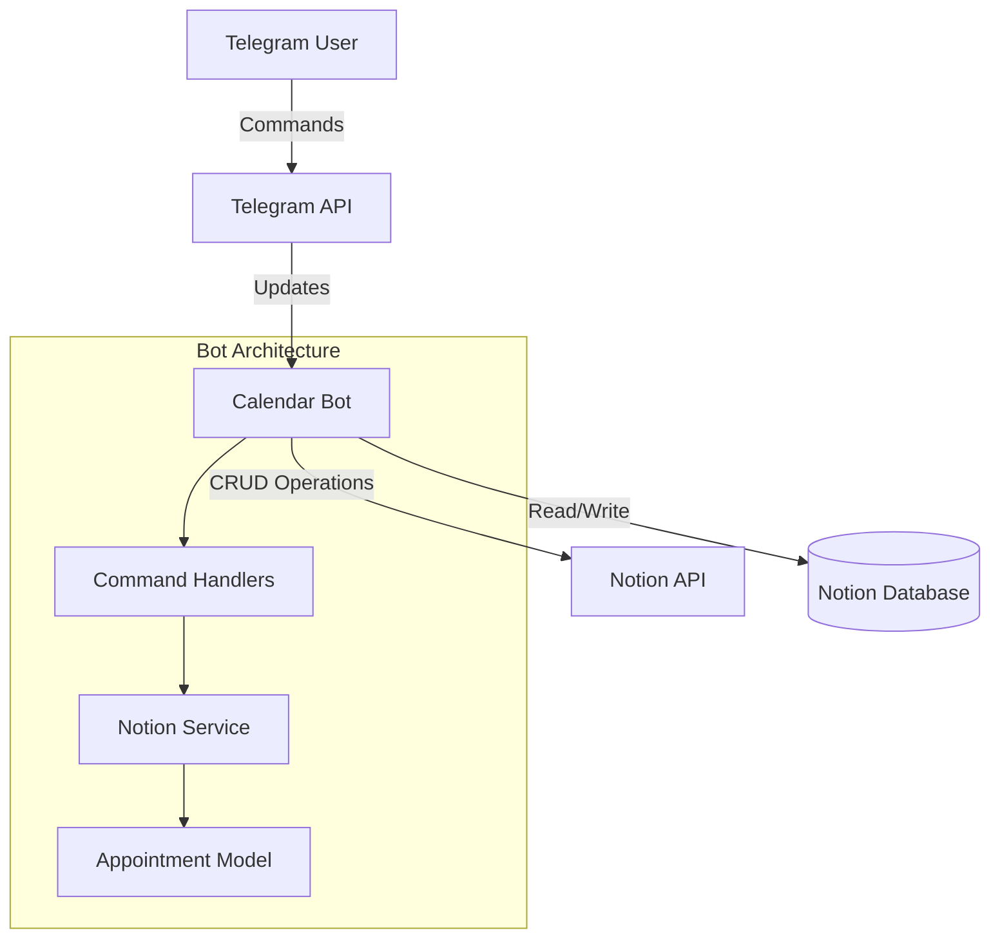

# Architecture Documentation

## System Overview



## Component Details

### 1. Entry Point (`src/bot.py`)

**Responsibilities:**
- Initialize Telegram Application
- Register Command Handlers
- Start polling for updates
- Connection status checking

**Key Classes:**
- `CalendarBot`: Main bot class with initialization logic

### 2. Models (`src/models/`)

#### `appointment.py`
**Purpose**: Data validation and serialization

**Key Features:**
- Pydantic BaseModel for validation
- Timezone-aware datetime handling
- Notion property mapping
- Telegram formatting

**Fields:**
```python
title: str          # Required, max 200 chars
date: datetime      # Required, must be future
description: str    # Optional, max 1000 chars
location: str       # Optional, max 200 chars
tags: List[str]     # Optional, stored as comma-separated
```

### 3. Services (`src/services/`)

#### `notion_service.py`
**Purpose**: Notion API abstraction layer

**Methods:**
- `create_appointment()`: Create new database entry
- `get_appointments()`: Retrieve sorted appointments
- `update_appointment()`: Update existing entry
- `delete_appointment()`: Archive entry
- `test_connection()`: Validate API access

**Error Handling:**
- APIResponseError catching
- Logging for debugging
- Graceful degradation

### 4. Handlers (`src/handlers/`)

#### `appointment_handler.py`
**Purpose**: Process Telegram commands

**Commands Implemented:**
- `/add`: Parse natural language, create appointment
- `/list`: Show upcoming appointments
- `/today`: Filter today's appointments

**Parsing Logic:**
- Relative dates: "heute", "morgen"
- Absolute dates: "DD.MM.YYYY"
- Time formats: "HH:MM" or "HH.MM"
- Timezone handling

## Data Flow

### Creating an Appointment

```
1. User sends: /add morgen 14:00 Meeting
2. Handler parses command arguments
3. Creates Appointment model instance
4. Validates data (future date, etc.)
5. Service creates Notion page
6. Returns confirmation to user
```

### Retrieving Appointments

```
1. User sends: /list
2. Handler calls service
3. Service queries Notion database
4. Converts pages to Appointment models
5. Filters future appointments
6. Formats for Telegram display
7. Sends formatted message
```

## Configuration Management

### Settings (`config/settings.py`)

**Environment Variables:**
- `TELEGRAM_BOT_TOKEN`: Bot authentication
- `NOTION_API_KEY`: Notion integration token
- `NOTION_DATABASE_ID`: Target database
- `TIMEZONE`: Default timezone (Europe/Berlin)
- `LANGUAGE`: UI language (de)
- `ENVIRONMENT`: development/testing/production

**Validation:**
- Required fields check
- Environment-specific behavior
- Testing mode bypasses validation

## Testing Strategy

### Test Pyramid

```
        /\
       /  \   E2E Tests (Manual)
      /    \  
     /------\ Integration Tests
    /        \ (Services + Handlers)
   /----------\ Unit Tests
  /            \ (Models, Utilities)
```

### Test Organization

**Fixtures (`tests/conftest.py`):**
- Mock Telegram Update/Context
- Mock Notion Client
- Test Settings

**Coverage Areas:**
- Model validation rules
- Service API interactions
- Handler command parsing
- Error scenarios

## Security Considerations

### Credentials
- Environment variables for secrets
- `.env` file excluded from git
- No hardcoded tokens

### Docker Security
- Non-root user execution
- Minimal base image
- No unnecessary packages

### Input Validation
- Pydantic model validation
- Command argument sanitization
- Date/time boundary checks

## Performance Considerations

### Current Limitations
- Synchronous Notion API calls
- No caching layer
- Linear search for filtering

### Optimization Opportunities
- Implement Redis caching
- Batch API operations
- Pagination for large datasets
- Connection pooling

## Extension Points

### Adding New Commands

1. Create handler method in `appointment_handler.py`
2. Register in `bot.py`
3. Add tests in `test_appointment_handler.py`

### Adding New Fields

1. Update `Appointment` model
2. Modify `to_notion_properties()` mapping
3. Update `from_notion_page()` parsing
4. Adjust Telegram formatting
5. Update tests

### Adding New Services

1. Create service class in `src/services/`
2. Initialize in bot constructor
3. Inject into handlers
4. Add service tests

## Deployment Architecture

### Local Development
```
Python Virtual Environment
    |
    +-- Bot Process
    +-- Notion API
    +-- Telegram API
```

### Docker Deployment
```
Docker Container
    |
    +-- Python 3.11
    +-- Bot Application
    +-- Volume: logs
```

### Production Recommendations
```
Cloud Server (VPS/EC2)
    |
    +-- Docker/Docker Compose
    +-- Nginx (if web interface)
    +-- Monitoring (Prometheus)
    +-- Logs (ELK Stack)
```

---

This architecture is designed for:
- **Maintainability**: Clear separation of concerns
- **Testability**: Dependency injection, mocking
- **Extensibility**: Easy to add features
- **Reliability**: Error handling, logging