# 🏗️ Architecture Documentation - Multi-User Calendar Bot

## 🌟 System Overview

```mermaid
graph TB
    %% Users
    U1[Telegram User 1] -->|Commands| TG[Telegram API]
    U2[Telegram User 2] -->|Commands| TG
    U3[Telegram User N] -->|Commands| TG
    
    %% Email Integration
    EM[📧 Gmail/Outlook] -->|IMAP| EmailSync[Email Sync Service]
    
    %% Core Bot
    TG -->|Updates| Bot[Enhanced Calendar Bot]
    EmailSync -->|Events| Bot
    
    %% User Management
    Bot -->|User Validation| UserConfig[User Config Manager]
    UserConfig -->|Valid Users| Bot
    
    %% Multiple Notion Databases
    Bot -->|Private Events| N1[(👤 Private DB 1)]
    Bot -->|Private Events| N2[(👤 Private DB 2)]
    Bot -->|Team Events| NS[(🌐 Shared DB)]
    Bot -->|Business Events| NB1[(📧 Business DB 1)]
    Bot -->|Business Events| NB2[(📧 Business DB 2)]
    
    %% Services Layer
    subgraph \"Core Services\"
        Bot --> AppHandler[Appointment Handler]
        Bot --> ReminderService[Reminder Service]
        Bot --> BusinessSync[Business Calendar Sync]
        
        AppHandler --> CombinedService[Combined Appointment Service]
        CombinedService --> NotionService[Notion Service]
        
        BusinessSync --> EmailProcessor[Email Processor]
        BusinessSync --> JSONParser[JSON Parser]
        BusinessSync --> NotionService
        
        ReminderService --> CombinedService
    end
    
    %% Configuration
    subgraph \"Configuration\"
        UserConfig --> UC[users_config.json]
        Bot --> EnvConfig[.env]
    end
```



## 🔧 Multi-User Architecture

### 1. User Configuration System (`config/user_config.py`)

**Purpose**: Centralized multi-user management with validation

**Key Features**:
- **Automatic Platzhalter Detection**: Ignores `secret_xxx_`, `your_notion_` values
- **API Key Validation**: Checks for valid Notion API keys (`secret_`, `ntn_`)
- **Database ID Validation**: Validates Notion Database IDs (32 hex chars)
- **Minimum User Requirement**: Bot only starts with at least one valid user

**Core Methods**:
```python
get_valid_users() -> Dict[int, UserConfig]  # Only returns valid users
is_user_config_valid(user_config) -> bool   # Validates configuration
get_user_config(user_id) -> UserConfig      # Get specific user config
```

**User Configuration Structure**:
```python
@dataclass
class UserConfig:
    telegram_user_id: int
    notion_api_key: str              # Private database
    notion_database_id: str          # Private database
    shared_notion_api_key: str       # Shared database
    shared_notion_database_id: str   # Shared database
    business_notion_api_key: str     # Business database (optional)
    business_notion_database_id: str # Business database (optional)
    timezone: str = 'Europe/Berlin'
    language: str = 'de'
    reminder_enabled: bool = True
    reminder_time: str = '08:00'
```

### 2. Entry Point (`src/bot.py`)

**Enhanced Multi-User Bot Class**:
```python
class EnhancedCalendarBot:
    def __init__(self):
        self.user_config_manager = UserConfigManager()
        self.business_sync_manager = BusinessCalendarSyncManager()
        self._handlers = {}  # User-specific handler cache
```

**Initialization Flow**:
1. **User Validation**: Load and validate user configurations
2. **Minimum User Check**: Exit if no valid users found
3. **Handler Caching**: Create user-specific handlers on demand
4. **Business Sync**: Start email synchronization for valid users
5. **Reminder Service**: Start combined reminder service

**User-Specific Handler Management**:
```python
def get_appointment_handler(self, user_id: int) -> EnhancedAppointmentHandler:
    # Cached handler creation per user
    if user_id in self._handlers:
        return self._handlers[user_id]
    
    user_config = self.user_config_manager.get_user_config(user_id)
    if not user_config:
        return None
    
    handler = EnhancedAppointmentHandler(user_config)
    self._handlers[user_id] = handler
    return handler
```

## 🗂️ Database Architecture

### Triple Database System

#### 1. **👤 Private Database** (Individual per User)
- **Purpose**: Personal appointments for each user
- **Access**: Only the specific user
- **Configuration**: `notion_api_key` + `notion_database_id`
- **Scalability**: One database per user

#### 2. **🌐 Shared Database** (Global)
- **Purpose**: Team appointments visible to all users
- **Access**: All users can read/write
- **Configuration**: `shared_notion_api_key` + `shared_notion_database_id`
- **Scalability**: Single database for all users

#### 3. **📧 Business Database** (Individual per User, Optional)
- **Purpose**: Automatic email synchronization
- **Access**: Automatically populated from emails
- **Configuration**: `business_notion_api_key` + `business_notion_database_id`
- **Scalability**: One database per user or shared

### Database Schema

**Unified Schema for All Database Types**:
```sql
-- Notion Database Properties
Name: Title          -- Appointment title (required)
Datum: Date          -- Date and time (required, with time support)
Beschreibung: Text   -- Description (optional)
OutlookID: Text      -- Unique ID for business events (optional)
Organizer: Text      -- Event organizer (optional)
```

## 🔧 Service Layer Architecture

### 1. Combined Appointment Service (`src/services/combined_appointment_service.py`)

**Purpose**: Unified access to all three database types

**Key Features**:
- **Database Aggregation**: Combines private, shared, and business databases
- **Source Tagging**: Marks appointments with source (👤 🌐 📧)
- **Intelligent Filtering**: Filters by date, user, source
- **Unified API**: Single interface for all database operations

**Core Methods**:
```python
def get_combined_appointments(self, days_ahead: int = 7) -> List[Appointment]:
    # Fetches from all three databases and combines
    
def get_appointments_by_date(self, target_date: date) -> List[Appointment]:
    # Date-specific filtering across all databases
    
def create_appointment(self, appointment: Appointment, database_type: str):
    # Creates in specified database type
```

### 2. Business Calendar Sync (`src/services/business_calendar_sync.py`)

**Purpose**: Automated email-to-calendar synchronization

**Architecture**:
```python
class BusinessCalendarSyncManager:
    def __init__(self, global_config: Dict):
        self.user_syncs: Dict[int, BusinessCalendarSync] = {}
    
    def add_user(self, user_config: UserConfig):
        # Only adds users with valid configurations
        
class BusinessCalendarSync:
    def __init__(self, user_config: UserConfig, global_config: Dict):
        self.email_processor = EmailProcessor()
        self.event_parser = BusinessEventParser()
        self.business_notion = NotionService()  # Business DB
        self.shared_notion = NotionService()    # Shared DB
```

**Email Processing Flow**:
1. **IMAP Connection**: Connect to Gmail/Outlook
2. **Email Filtering**: Apply sender whitelist
3. **Content Parsing**: Extract JSON from email body
4. **Event Creation**: Create/update/delete in Notion
5. **Duplicate Detection**: Use OutlookID for deduplication
6. **Email Cleanup**: Delete processed emails

### 3. Enhanced Reminder Service (`src/services/enhanced_reminder_service.py`)

**Purpose**: Smart reminders from all database sources

**Features**:
- **Multi-Database Support**: Checks all three database types
- **User-Specific Timing**: Individual reminder times per user
- **Source Indication**: Shows appointment source in reminders
- **Intelligent Grouping**: Groups appointments by source

## 📧 Business Email Integration

### Email Processing Pipeline

```mermaid
graph LR
    EM[📧 Gmail/Outlook] --> EP[Email Processor]
    EP --> SF[Sender Filter]
    SF --> CF[Content Filter]
    CF --> JP[JSON Parser]
    JP --> EV[Event Validator]
    EV --> NS[Notion Service]
    NS --> ED[Email Deletion]
    
    subgraph \"Filtering\"
        SF --> |Whitelist| SW[Sender Whitelist]
        CF --> |Keywords| KW[Subject Keywords]
        CF --> |Format| JF[JSON Format]
    end
    
    subgraph \"Processing\"
        JP --> |CREATE| CREATE[Create Event]
        JP --> |UPDATE| UPDATE[Update Event]
        JP --> |DELETE| DELETE[Delete Event]
    end
```



### Email Content Processing

**Supported Email Formats**:
- **Subject Keywords**: `terminweiterleitung`, `calendar forward`, `termin`, `meeting`
- **JSON Structure**: Body must contain `{` and `\"Action\"`
- **Action Types**: `CREATE`, `UPDATE`, `DELETE`, `CANCEL`

**JSON Event Format**:
```json
{
  \"Action\": \"CREATE\",
  \"Subject\": \"Team Meeting\",
  \"StartDateTime\": \"2024-06-15T14:00:00\",
  \"EndDateTime\": \"2024-06-15T15:00:00\",
  \"Organizer\": \"john.doe@company.com\",
  \"ICalUId\": \"unique-event-id-123\"
}
```

### Security Features

**Email Security**:
- **Sender Whitelist**: Only trusted senders can create events
- **Size Limits**: Max 50KB per email, 10KB per JSON
- **Format Validation**: Strict JSON structure validation
- **Action Validation**: Only allowed actions processed

## 🔒 Security Architecture

### Multi-Layer Security

#### 1. **User Authorization**
```python
# Environment-based authorization
AUTHORIZED_USERS=123456789,987654321
ADMIN_USERS=123456789

# Dynamic user validation
def is_authorized_user(user_id: int) -> bool:
    return user_id in authorized_users or not authorized_users
```

#### 2. **Configuration Validation**
```python
# Automatic platzhalter detection
def is_valid_notion_key(api_key: str) -> bool:
    if not api_key or any(pattern in api_key.lower() for pattern in PLACEHOLDER_PATTERNS):
        return False
    return api_key.startswith(('secret_', 'ntn_'))

# Database ID validation
def is_valid_database_id(database_id: str) -> bool:
    clean_id = database_id.replace('-', '').replace('_', '')
    return len(clean_id) >= 30 and all(c in '0123456789abcdef' for c in clean_id.lower())
```

#### 3. **Email Security**
```python
# Sender whitelist enforcement
def is_authorized_sender(sender: str) -> bool:
    return sender in OUTLOOK_SENDER_WHITELIST.split(',')

# Content size limits
MAX_EMAIL_SIZE = 50 * 1024  # 50KB
MAX_JSON_SIZE = 10 * 1024   # 10KB
```

#### 4. **Rate Limiting**
```python
# Per-user rate limiting
RATE_LIMIT = 30  # requests per minute
```

## 🚀 Performance Optimizations

### Caching Strategy

**User Handler Caching**:
```python
self._handlers = {}  # Cache user-specific handlers
```

**Configuration Caching**:
```python
self._users = {}     # Cache validated user configurations
```

### Async Processing

**Email Processing**:
```python
# Async email processing with thread pools
with ThreadPoolExecutor(max_workers=1) as executor:
    emails = await loop.run_in_executor(executor, fetch_emails)
```

**Concurrent Operations**:
```python
# Parallel database operations
tasks = [
    create_task(process_private_db()),
    create_task(process_shared_db()),
    create_task(process_business_db())
]
await gather(*tasks)
```

## 📊 Data Flow

### User Interaction Flow


### Business Email Flow


## 🔧 Extension Points

### Adding New Database Types

1. **Update UserConfig**: Add new database fields
2. **Extend CombinedService**: Add new database integration
3. **Update Handlers**: Support new database type
4. **Add Migration**: Handle existing users

### Adding New Email Providers

1. **Create EmailProvider**: Abstract email provider interface
2. **Implement Provider**: Gmail, Outlook, Exchange
3. **Update Configuration**: Add provider-specific settings
4. **Test Integration**: Ensure compatibility

### Adding New Features

1. **Service Layer**: Create new service classes
2. **Handler Integration**: Add to appointment handlers
3. **Configuration**: Add to user config if needed
4. **Testing**: Comprehensive test coverage

## 🐳 Deployment Architecture

### Development Environment
```
Local Machine
├── Python 3.11
├── Virtual Environment
├── .env (local config)
├── users_config.json (test users)
└── SQLite (if caching implemented)
```

### Production Environment
```
Docker Container
├── Alpine Linux
├── Python 3.11
├── Non-root user (botuser)
├── Volume mounts
│   ├── .env
│   ├── users_config.json
│   └── logs/
└── Health checks
```

### Multi-Instance Deployment
```
Load Balancer
├── Bot Instance 1 (Users 1-100)
├── Bot Instance 2 (Users 101-200)
├── Shared Redis Cache
└── Centralized Logging
```

## 📈 Scalability Considerations

### Current Limitations
- **Single Process**: All users in one bot instance
- **Memory Storage**: User configs in memory
- **Sequential Processing**: One email at a time

### Scaling Solutions
- **User Sharding**: Distribute users across instances
- **Database Caching**: Redis for user configs
- **Async Processing**: Concurrent email processing
- **Queue System**: RabbitMQ for async tasks

## 🔍 Monitoring & Observability

### Metrics
```python
# Key metrics to track
user_count = len(valid_users)
email_processing_rate = emails_per_minute
notion_api_calls = api_calls_per_minute
error_rate = errors_per_minute
```

### Logging
```python
# Structured logging
logger.info(f\"User {user_id} created appointment\", extra={
    'user_id': user_id,
    'database_type': 'private',
    'appointment_title': title
})
```

### Health Checks
```python
# Health check endpoints
def health_check():
    return {
        'status': 'healthy',
        'valid_users': len(valid_users),
        'email_sync_active': email_sync_running,
        'notion_connectivity': test_notion_connection()
    }
```

---

**Architecture Goals Achieved**:
- ✅ **Multi-User Support**: Isolated user contexts
- ✅ **Scalability**: Configurable user limits
- ✅ **Security**: Multi-layer validation
- ✅ **Extensibility**: Clear extension points
- ✅ **Maintainability**: Modular design
- ✅ **Reliability**: Comprehensive error handling
- ✅ **Performance**: Caching and async processing

*Last Updated: 2024-06-15*  
*Version: 2.0.0 - Multi-User Architecture with Business Email Integration*