# 📚 API Documentation

## Overview

The Enhanced Telegram Notion Calendar Bot provides both user-facing Telegram commands and internal service APIs. This documentation covers all available interfaces, data models, and integration points.

## Table of Contents

1. [Bot Commands](#bot-commands)
2. [Service APIs](#service-apis)
3. [Data Models](#data-models)
4. [Callbacks & Events](#callbacks--events)
5. [Configuration APIs](#configuration-apis)
6. [Error Handling](#error-handling)
7. [Examples](#examples)

## Bot Commands

### Main Navigation

#### `/start` - Main Menu
```python
async def start(update: Update, context: ContextTypes.DEFAULT_TYPE)
```

Shows the simplified 2x2+1 main menu with quick access to common functions.

**Response Format:**
```
┌─────────────────────┬─────────────────────┐
│ 📅 Termine Heute    │ 📝 Letzte 10 Memos │
│    & Morgen         │                     │
├─────────────────────┼─────────────────────┤
│ ➕ Neuer Termin     │ ➕ Neues Memo       │
├─────────────────────┴─────────────────────┤
│            ❓ Hilfe                        │
└───────────────────────────────────────────┘
```

#### `/help` - Help Information
```python
async def help_command(update: Update, context: ContextTypes.DEFAULT_TYPE)
```

Displays comprehensive help including supported date/time formats and examples.

### Appointment Commands

#### `/today` - Today's Appointments
```python
async def today_appointments(update: Update, context: ContextTypes.DEFAULT_TYPE)
```

Lists all appointments for the current day from both private and shared databases.

#### `/tomorrow` - Tomorrow's Appointments
```python
async def tomorrow_appointments(update: Update, context: ContextTypes.DEFAULT_TYPE)
```

Lists all appointments for the next day.

#### `/list` - All Upcoming Appointments
```python
async def list_appointments(update: Update, context: ContextTypes.DEFAULT_TYPE)
```

Shows all future appointments sorted by date.

### Reminder Commands

#### `/reminder on` - Enable Reminders
```python
async def enable_reminders(update: Update, context: ContextTypes.DEFAULT_TYPE)
```

Enables daily appointment reminders.

#### `/reminder off` - Disable Reminders
```python
async def disable_reminders(update: Update, context: ContextTypes.DEFAULT_TYPE)
```

Disables daily appointment reminders.

#### `/reminder time HH:MM` - Set Reminder Time
```python
async def set_reminder_time(update: Update, context: ContextTypes.DEFAULT_TYPE)
```

Sets the daily reminder time (24-hour format).

## Service APIs

### CombinedAppointmentService

Main service for managing appointments across databases.

#### create_appointment_from_text
```python
async def create_appointment_from_text(
    self,
    text: str,
    user_name: str = None,
    telegram_user_id: int = None,
    pending_callback_id: str = None
) -> Appointment
```

Creates an appointment using AI to extract details from natural language.

**Parameters:**
- `text` (str): Natural language text containing appointment details
- `user_name` (str, optional): Username for tracking
- `telegram_user_id` (int, optional): Telegram user ID
- `pending_callback_id` (str, optional): ID for partner relevance callback

**Returns:**
- `Appointment`: Created appointment object

**Example:**
```python
appointment = await service.create_appointment_from_text(
    "Tomorrow 3pm dentist appointment at Main Street Clinic"
)
```

#### get_appointments_for_date_range
```python
async def get_appointments_for_date_range(
    self,
    start_date: datetime,
    end_date: datetime,
    include_shared: bool = True
) -> List[AppointmentSource]
```

Retrieves appointments within a date range from all configured databases.

**Parameters:**
- `start_date` (datetime): Range start (inclusive)
- `end_date` (datetime): Range end (inclusive)
- `include_shared` (bool): Include shared database appointments

**Returns:**
- `List[AppointmentSource]`: Appointments with source information

### AIAssistantService

Service for AI-powered text processing.

#### extract_appointment_from_text
```python
async def extract_appointment_from_text(
    self,
    text: str,
    user_timezone: str = "Europe/Berlin"
) -> Optional[Dict[str, Any]]
```

Extracts appointment details from natural language text.

**Returns Dictionary Structure:**
```python
{
    "title": str,           # Appointment title
    "date": str,            # ISO format date
    "time": str,            # HH:MM format
    "location": str,        # Optional location
    "description": str,     # Optional description
    "partner_relevant": bool # Partner sharing flag
}
```

#### extract_memo_from_text
```python
async def extract_memo_from_text(self, text: str) -> Optional[Dict[str, Any]]
```

Extracts memo/task details from natural language text.

**Returns Dictionary Structure:**
```python
{
    "aufgabe": str,         # Task description
    "status": str,          # Status (Not started/In progress/Completed)
    "faelligkeitsdatum": str, # Optional due date
    "bereich": List[str],   # Categories
    "projekt": List[str],   # Project tags
    "notizen": str          # Additional notes
}
```

### PartnerSyncService

Manages partner relevance and sharing between databases.

#### create_with_partner_relevance
```python
async def create_with_partner_relevance(
    self,
    appointment_data: dict,
    is_partner_relevant: bool
) -> Tuple[Appointment, Optional[Appointment]]
```

Creates appointment in private database and optionally in shared database.

**Returns:**
- Tuple of (private_appointment, shared_appointment or None)

## Data Models

### Appointment Model

```python
@dataclass
class Appointment:
    title: str
    date: datetime
    description: Optional[str] = None
    location: Optional[str] = None
    notion_page_id: Optional[str] = None
    partner_relevant: bool = False
    is_shared_appointment: bool = False
    outlook_id: Optional[str] = None
    
    def validate_date(cls, v) -> datetime
    def validate_title(cls, v) -> str
```

### Memo Model

```python
@dataclass
class Memo:
    aufgabe: str                    # Task title
    status: str = "Nicht begonnen"  # Status
    faelligkeitsdatum: Optional[datetime] = None
    bereich: List[str] = field(default_factory=list)
    projekt: List[str] = field(default_factory=list)
    notizen: Optional[str] = None
    notion_page_id: Optional[str] = None
```

### AppointmentSource Model

```python
@dataclass
class AppointmentSource:
    appointment: Appointment
    is_shared: bool  # True if from shared database
```

## Callbacks & Events

### Callback Data Format

All callbacks use prefixed strings for routing:

```python
# Main menu callbacks
"main_menu"           # Return to main menu
"today_tomorrow"      # Show today/tomorrow appointments
"recent_memos"        # Show recent memos
"add_appointment"     # Start appointment creation
"add_memo"           # Start memo creation
"help"               # Show help

# Partner relevance callbacks
"partner_relevant_{uuid}"      # Partner relevance prompt
"appointment_share_yes_{uuid}" # Share with partner
"appointment_share_no_{uuid}"  # Keep private

# Memo callbacks
"memo_set_status_{page_id}_{status}" # Update memo status
"memo_filter_status_{status}"        # Filter memos by status
```

### Event Flow Example

```mermaid
sequenceDiagram
    participant User
    participant Bot
    participant AI
    participant Service
    participant Notion

    User->>Bot: "Tomorrow 3pm dentist"
    Bot->>AI: extract_appointment_from_text()
    AI-->>Bot: {title, date, time}
    Bot->>User: "Share with partner?" [Yes][No]
    User->>Bot: Click "Yes"
    Bot->>Service: create_with_partner_relevance()
    Service->>Notion: Create in private DB
    Service->>Notion: Create in shared DB
    Service-->>Bot: Success
    Bot->>User: "✅ Appointment created"
```



## Configuration APIs

### UserConfig

```python
@dataclass
class UserConfig:
    telegram_user_id: int
    telegram_username: str
    notion_api_key: str
    notion_database_id: str
    shared_notion_database_id: Optional[str] = None
    business_notion_database_id: Optional[str] = None
    timezone: str = "Europe/Berlin"
    language: str = "de"
    reminder_enabled: bool = True
    reminder_time: str = "08:00"
    teamspace_owner_user_id: Optional[int] = None
    teamspace_owner_api_key: Optional[str] = None
```

### UserConfigManager

```python
class UserConfigManager:
    def get_valid_users(self) -> Dict[int, UserConfig]
    def get_user_config(self, user_id: int) -> Optional[UserConfig]
    def is_user_authorized(self, user_id: int) -> bool
    def update_user_config(self, user_id: int, updates: dict) -> bool
```

## Error Handling

### Error Types

```python
class ErrorType(Enum):
    VALIDATION = "validation"
    NOTION_API = "notion_api"
    AI_SERVICE = "ai_service"
    CONFIGURATION = "configuration"
    RATE_LIMIT = "rate_limit"
    AUTHORIZATION = "authorization"
```

### Error Response Format

```python
{
    "error": {
        "type": "validation",
        "message": "Invalid date format",
        "user_message": "❌ Ungültiges Datum. Bitte verwende ein Format wie 'morgen 15:00'.",
        "details": {...}
    }
}
```

### Error Handling Decorator

```python
@handle_bot_error(ErrorType.AI_SERVICE, ErrorSeverity.MEDIUM)
async def some_ai_operation(self):
    # Operation that might fail
    pass
```

## Examples

### Creating an Appointment

```python
# Initialize service
service = CombinedAppointmentService(user_config)

# Create from natural language
appointment = await service.create_appointment_from_text(
    "Next Monday 2pm team meeting in conference room"
)

# Create with explicit data
appointment_data = {
    "title": "Team Meeting",
    "date": datetime(2024, 1, 15, 14, 0),
    "location": "Conference Room",
    "description": "Weekly sync"
}
appointment = await service.create_appointment(appointment_data)
```

### Managing Memos

```python
# Initialize service
memo_service = MemoService(user_config)

# Create memo from text
memo = await memo_service.create_memo_from_text(
    "Finish presentation for Friday's client meeting"
)

# Update memo status
await memo_service.update_memo_status(
    memo.notion_page_id,
    MemoStatus.IN_PROGRESS
)

# Get memos by status
active_memos = await memo_service.get_memos_by_status(
    [MemoStatus.NOT_STARTED, MemoStatus.IN_PROGRESS]
)
```

### Handling Partner Relevance

```python
# In appointment handler
async def handle_appointment_creation(self, update, context):
    # Extract appointment
    data = await self.ai_service.extract_appointment_from_text(text)
    
    # Create with pending callback
    callback_id = str(uuid.uuid4())
    appointment = await self.service.create_appointment_from_text(
        text,
        pending_callback_id=callback_id
    )
    
    # Ask for partner relevance
    keyboard = [
        [
            InlineKeyboardButton("✅ Yes", callback_data=f"appointment_share_yes_{callback_id}"),
            InlineKeyboardButton("❌ No", callback_data=f"appointment_share_no_{callback_id}")
        ]
    ]
    await update.message.reply_text(
        "Should this appointment be visible to your partner?",
        reply_markup=InlineKeyboardMarkup(keyboard)
    )
```

### Rate Limiting

```python
from utils.rate_limiter import rate_limit

@rate_limit(max_requests=20, time_window=60)
async def handle_command(self, update, context):
    # This handler is limited to 20 requests per minute
    pass
```

## Testing

### Unit Test Example

```python
@pytest.mark.asyncio
async def test_appointment_creation():
    # Mock dependencies
    mock_notion = AsyncMock()
    mock_ai = AsyncMock()
    
    # Setup service
    service = CombinedAppointmentService(test_config)
    service.notion_service = mock_notion
    service.ai_service = mock_ai
    
    # Configure mocks
    mock_ai.extract_appointment_from_text.return_value = {
        "title": "Test Appointment",
        "date": "2024-01-15",
        "time": "14:00"
    }
    
    # Test
    result = await service.create_appointment_from_text("test input")
    
    # Assertions
    assert result.title == "Test Appointment"
    mock_notion.create_appointment.assert_called_once()
```

## API Versioning

Current API Version: **1.0.0**

Breaking changes will increment the major version. New features increment minor version.

## Rate Limits

- **Commands**: 20 requests per minute per user
- **AI Operations**: 10 requests per minute per user
- **Notion API**: 3 requests per second (shared across all users)

## Support

For API support and questions:
- GitHub Issues: [Project Issues](https://github.com/username/telegram-notion-calendar-bot/issues)
- Documentation: [Full Documentation](../README.md)