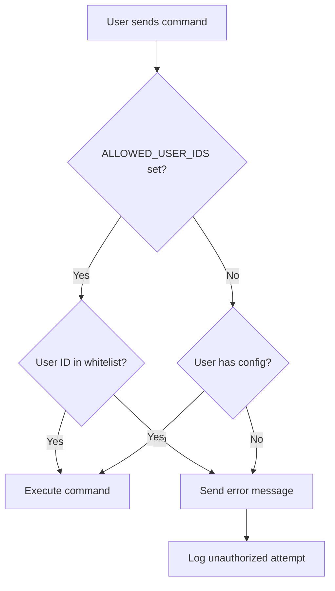

# Authorization API Documentation

## Overview

The Telegram Notion Calendar Bot implements a comprehensive authorization system to ensure only authorized users can access bot functionality. This document describes the authorization decorator and its usage.

## Authorization Decorator

### `@require_authorized_user`

A decorator that enforces user authorization before executing command handlers.

#### Location
`src/bot.py`

#### Signature
```python
def require_authorized_user(func: Callable) -> Callable:
    """Decorator to check if user is authorized before processing commands."""
```

#### Authorization Logic

The decorator implements a two-tier authorization system:

1. **Whitelist Mode** (Primary)
   - Checks if `ALLOWED_USER_IDS` environment variable is set
   - Only users whose Telegram ID is in the whitelist can access the bot
   - Most secure option for production environments

2. **Configuration Mode** (Fallback)
   - If no whitelist is defined, checks if user has valid configuration
   - Less secure as anyone with config file access could potentially use the bot

#### Environment Variables

| Variable | Type | Description | Example |
|----------|------|-------------|---------|
| `ALLOWED_USER_IDS` | String | Comma-separated list of authorized Telegram user IDs | `"123456789,987654321"` |

#### Error Handling

Unauthorized users receive appropriate error messages:
- For message commands: Text reply with error
- For callback queries: Alert dialog with error

All unauthorized access attempts are logged for security monitoring.

---

## Usage Examples

### Basic Usage

```python
from telegram import Update
from telegram.ext import ContextTypes
from functools import wraps

@require_authorized_user
async def start(self, update: Update, context: ContextTypes.DEFAULT_TYPE) -> None:
    """Handle /start command - only for authorized users."""
    # Your handler code here
    await update.message.reply_text("Welcome!")
```

### Applied to All Command Handlers

```python
class CalendarBot:
    @require_authorized_user
    async def start(self, update: Update, context: ContextTypes.DEFAULT_TYPE) -> None:
        """Main menu - requires authorization."""
        pass
    
    @require_authorized_user
    async def handle_callback_query(self, update: Update, context: ContextTypes.DEFAULT_TYPE) -> None:
        """Handle button clicks - requires authorization."""
        pass
    
    @require_authorized_user
    async def handle_appointment_command(self, update: Update, context: ContextTypes.DEFAULT_TYPE, command: str) -> None:
        """Handle appointment commands - requires authorization."""
        pass
```

---

## Configuration

### Setting Up Whitelist Authorization

1. **Environment Variable** (.env file):
```env
ALLOWED_USER_IDS=123456789,987654321,555666777
```

2. **Docker Compose**:
```yaml
environment:
  - ALLOWED_USER_IDS=${ALLOWED_USER_IDS}
```

3. **Direct Export**:
```bash
export ALLOWED_USER_IDS="123456789,987654321"
```

### Getting Telegram User IDs

Users can get their Telegram ID by:
1. Sending any message to the bot
2. Checking bot logs for "Unauthorized access attempt by user {ID}"
3. Using Telegram bots like @userinfobot

---

## Security Considerations

### Best Practices

1. **Always use whitelist in production**
   - Set `ALLOWED_USER_IDS` for all production deployments
   - Regularly audit the whitelist

2. **Secure configuration files**
   - Protect `users_config.json` with appropriate file permissions
   - Never commit configuration files with real user data

3. **Monitor unauthorized access**
   - Regular log reviews for unauthorized access attempts
   - Set up alerts for repeated unauthorized attempts

### Authorization Flow



---

## Integration with Other Security Features

### Rate Limiting
Authorization checks happen before rate limiting to prevent unauthorized users from consuming rate limit quota.

### Connection Pooling
Authorized users benefit from connection pooling for improved performance.

### Error Handling
Authorization failures are handled gracefully without exposing internal system details.

---

## Migration Guide

### From Open Access to Authorized Access

1. **Identify authorized users**
   - Get Telegram IDs of all legitimate users
   - Document user list for audit purposes

2. **Set environment variable**
   ```bash
   export ALLOWED_USER_IDS="user1_id,user2_id,user3_id"
   ```

3. **Test authorization**
   - Have authorized user test all functions
   - Have unauthorized user verify access is blocked

4. **Monitor logs**
   - Check for any unexpected authorization failures
   - Adjust whitelist as needed

### Backward Compatibility

The system maintains backward compatibility:
- If no whitelist is set, falls back to config-based auth
- Existing deployments continue to work without changes
- Can gradually migrate to whitelist-based auth

---

## Troubleshooting

### Common Issues

#### "Unauthorized access" for legitimate user
**Causes:**
- User ID not in `ALLOWED_USER_IDS`
- Typo in user ID
- Environment variable not properly set

**Solution:**
1. Check exact user ID in logs
2. Verify environment variable: `echo $ALLOWED_USER_IDS`
3. Ensure no spaces around commas in ID list

#### Environment variable not working
**Causes:**
- Variable not exported
- Docker not passing variable
- Process started before variable set

**Solution:**
1. Use `export` command
2. Restart bot process
3. Verify in Docker: `docker exec container_name env`

#### All users blocked (including admin)
**Causes:**
- Empty or malformed `ALLOWED_USER_IDS`
- Missing user configuration files

**Solution:**
1. Temporarily remove `ALLOWED_USER_IDS` to use config fallback
2. Fix and re-apply whitelist
3. Ensure at least one admin user in whitelist

---

## API Reference

### Decorator Parameters
None - The decorator uses the class instance's `user_config_manager`

### Decorator Return
- Wrapped async function that performs authorization check

### Exceptions
- No exceptions raised
- Unauthorized access results in user-friendly error messages

### Logging
- All unauthorized attempts logged at WARNING level
- Includes user ID and timestamp

---

## Examples

### Custom Authorization Logic

To extend authorization logic:

```python
def require_admin_user(func: Callable) -> Callable:
    """Decorator for admin-only commands."""
    @wraps(func)
    async def wrapper(self, update: Update, context: ContextTypes.DEFAULT_TYPE, *args, **kwargs):
        user_id = update.effective_user.id
        admin_ids = os.getenv('ADMIN_USER_IDS', '').split(',')
        
        if str(user_id) not in admin_ids:
            await update.message.reply_text("⛔ Admin access required")
            logger.warning(f"Admin access attempt by non-admin user {user_id}")
            return
            
        return await func(self, update, context, *args, **kwargs)
    return wrapper
```

### Conditional Authorization

```python
@require_authorized_user
async def sensitive_command(self, update: Update, context: ContextTypes.DEFAULT_TYPE) -> None:
    """Command that requires additional checks."""
    user_id = update.effective_user.id
    
    # Additional business logic checks
    if not self.user_has_premium(user_id):
        await update.message.reply_text("💎 Premium feature - upgrade required")
        return
    
    # Proceed with command
```

---

*Last updated: January 2025*  
*Part of Telegram Notion Calendar Bot Security Documentation*