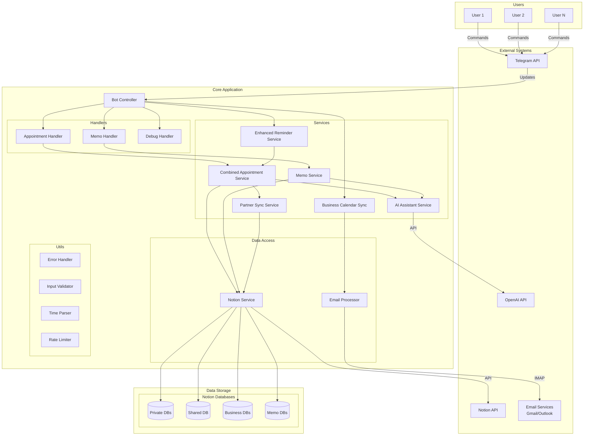
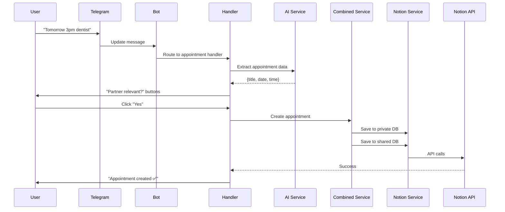
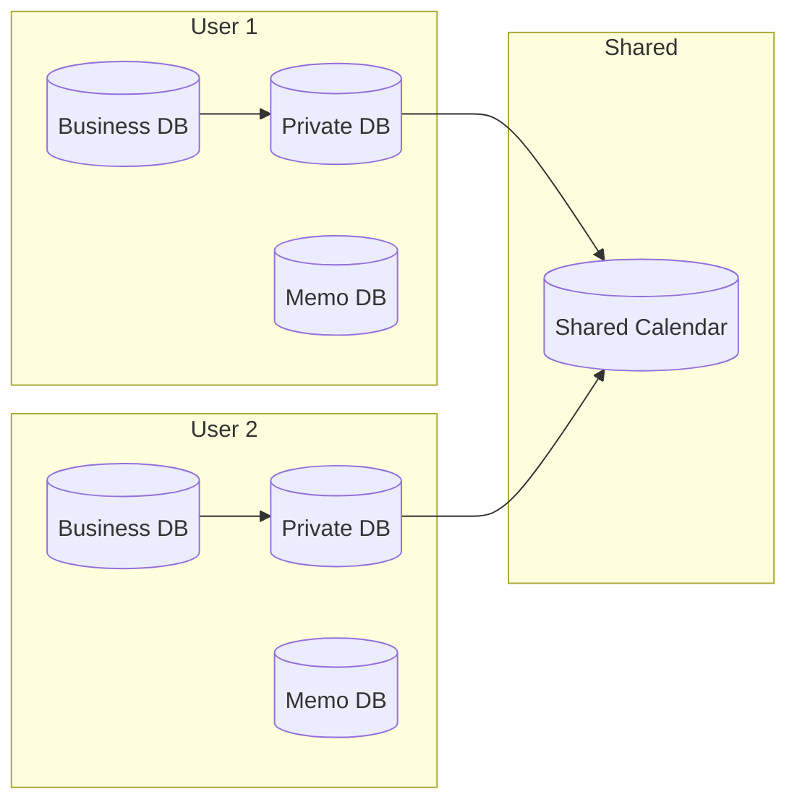
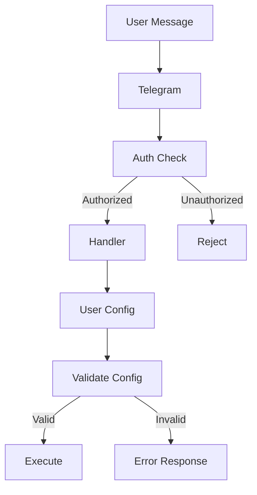

# 🏗️ Architecture Documentation

## Table of Contents

1. [System Overview](#system-overview)
2. [Core Components](#core-components)
3. [Data Flow](#data-flow)
4. [Design Patterns](#design-patterns)
5. [Database Architecture](#database-architecture)
6. [Security Architecture](#security-architecture)
7. [Scalability Considerations](#scalability-considerations)
8. [Technology Stack](#technology-stack)

## System Overview

The Enhanced Telegram Notion Calendar Bot is a sophisticated multi-user system that integrates Telegram messaging with Notion databases for calendar and memo management. It features AI-powered natural language processing, email synchronization, and partner sharing capabilities.

### High-Level Architecture



## Core Components

### 1. Bot Controller (`src/bot.py`)

The main entry point that orchestrates all bot functionality:

- **Command Registration**: Maps Telegram commands to appropriate handlers
- **User Authentication**: Validates users against whitelist
- **Handler Routing**: Routes messages to correct handler based on user state
- **Error Recovery**: Global error handling and user notification

Key Methods:
```python
async def start(update: Update, context: ContextTypes.DEFAULT_TYPE)
async def handle_button_callback(update: Update, context: ContextTypes.DEFAULT_TYPE)
def get_appointment_handler(user_id: int) -> EnhancedAppointmentHandler
```

### 2. Handler Layer

#### Enhanced Appointment Handler (`handlers/enhanced_appointment_handler.py`)
- Manages appointment creation, listing, and partner relevance
- Integrates with AI service for natural language processing
- Handles callback queries for interactive buttons

#### Memo Handler (`handlers/memo_handler.py`)
- Processes memo creation and management
- Uses AI for extracting structured data from text
- Manages memo status updates and filtering

#### Base Handler (`handlers/base_handler.py`)
- Provides common functionality for all handlers
- Timezone management
- Error handling patterns
- Shared utilities

### 3. Service Layer

#### Combined Appointment Service (`services/combined_appointment_service.py`)
- Unified interface for all appointment operations
- Manages three database types (private, shared, business)
- Handles duplicate detection across databases

#### AI Assistant Service (`services/ai_assistant_service.py`)
- OpenAI GPT-4o-mini integration
- Fallback mechanisms for service unavailability
- Structured data extraction from natural language

#### Partner Sync Service (`services/partner_sync_service.py`)
- Manages partner relevance feature
- Coordinates between private and shared databases
- Handles interactive callbacks for sharing decisions

#### Business Calendar Sync (`services/business_calendar_sync.py`)
- Email integration (Gmail/Outlook)
- Automatic appointment extraction from emails
- Guaranteed email deletion after processing

### 4. Data Access Layer

#### Notion Service (`services/notion_service.py`)
- Direct Notion API integration
- CRUD operations for appointments and memos
- Database schema validation

#### Email Processor (`services/email_processor.py`)
- IMAP connection management
- Email parsing and filtering
- Secure credential handling

### 5. Utility Layer

#### Error Handler (`utils/error_handler.py`)
- Centralized error management
- Error categorization and severity levels
- User-friendly error messages

#### Input Validator (`utils/input_validator.py`)
- Pydantic-based validation
- Security filtering
- Data sanitization

#### Time Parser (`utils/robust_time_parser.py`)
- Natural language date/time parsing
- Multi-language support (DE/EN)
- Timezone-aware conversions

## Data Flow

### Appointment Creation Flow



## Design Patterns

### 1. Repository Pattern
- Services abstract data access logic
- Consistent interface regardless of storage backend
- Easy to mock for testing

### 2. Handler Pattern
- Separate handlers for different message types
- Common base handler for shared functionality
- Clear separation of concerns

### 3. Service Layer Pattern
- Business logic separated from handlers
- Reusable services across different handlers
- Testable in isolation

### 4. Factory Pattern
- User-specific handler creation
- Cached handler instances
- Dynamic configuration loading

### 5. Strategy Pattern
- Multiple database strategies (private/shared/business)
- AI service with fallback strategies
- Flexible reminder scheduling

## Database Architecture

### Multi-Database System



### Database Schemas

#### Appointment Database Schema
| Property | Type | Required | Description |
|----------|------|----------|-------------|
| Name | Title | ✅ | Appointment title |
| Datum | Date | ✅ | Date and time |
| Beschreibung | Rich Text | ❌ | Additional details |
| Ort | Rich Text | ❌ | Location |
| PartnerRelevant | Checkbox | ✅ | Shared visibility |
| OutlookID | Rich Text | ❌ | Email sync tracking |

#### Memo Database Schema
| Property | Type | Required | Description |
|----------|------|----------|-------------|
| Aufgabe | Title | ✅ | Task description |
| Status | Status | ✅ | Progress state |
| Fälligkeitsdatum | Date | ❌ | Due date |
| Bereich | Multi-Select | ❌ | Categories |
| Projekt | Multi-Select | ❌ | Project tags |
| Notizen | Rich Text | ❌ | Additional notes |

## Security Architecture

### Authentication & Authorization



### Security Features

1. **User Whitelisting**
   - Environment variable `AUTHORIZED_USERS`
   - Telegram user ID validation
   - Admin user designation

2. **Input Validation**
   - Pydantic models for all inputs
   - SQL injection prevention
   - XSS protection in messages

3. **Rate Limiting**
   - Per-user command limits
   - Configurable time windows
   - Automatic cooldown messages

4. **Credential Security**
   - Environment variables for secrets
   - No hardcoded credentials
   - Secure email password handling

5. **Error Handling**
   - No sensitive data in error messages
   - Logged errors sanitized
   - User-friendly error responses

## Scalability Considerations

### Horizontal Scaling

1. **Stateless Design**
   - No in-memory session storage
   - All state in external databases
   - Ready for multiple instances

2. **Database Per User**
   - Individual Notion databases
   - No cross-user data conflicts
   - Linear scaling with users

3. **Caching Strategy**
   - Handler instance caching
   - Configuration caching
   - Reduced API calls

### Performance Optimizations

1. **Async Operations**
   - All I/O operations async
   - Non-blocking handler execution
   - Concurrent user handling

2. **Batch Operations**
   - Bulk reminder checks
   - Grouped API calls
   - Efficient email processing

3. **Connection Pooling**
   - Reused HTTP sessions
   - Persistent email connections
   - Reduced connection overhead

## Technology Stack

### Core Technologies

- **Language**: Python 3.10+
- **Framework**: python-telegram-bot 20.x
- **Async Runtime**: asyncio
- **Type Checking**: mypy with strict mode

### External Services

- **Messaging**: Telegram Bot API
- **Database**: Notion API
- **AI**: OpenAI GPT-4o-mini
- **Email**: IMAP (Gmail/Outlook)

### Development Tools

- **Testing**: pytest, pytest-asyncio
- **Mocking**: pytest-mock, AsyncMock
- **Coverage**: pytest-cov
- **Linting**: flake8, black, isort
- **Security**: bandit, safety

### Deployment

- **Container**: Docker
- **Orchestration**: docker-compose
- **Environment**: Linux/Unix preferred
- **Process Manager**: Python asyncio

## Architectural Decisions

### ADR-001: Repository Pattern for Data Access
**Status**: Accepted  
**Context**: Need to abstract Notion API complexity  
**Decision**: Use service layer as repository  
**Consequences**: Easier testing, consistent interface

### ADR-002: Handler Decomposition
**Status**: Accepted  
**Context**: Monolithic handlers becoming unmaintainable  
**Decision**: Split into focused handlers with base class  
**Consequences**: Better separation of concerns, reusable code

### ADR-003: Constants Extraction
**Status**: Accepted  
**Context**: Magic strings and numbers throughout code  
**Decision**: Centralize in constants.py  
**Consequences**: Easier maintenance, reduced typos

### ADR-004: Multi-Database Architecture
**Status**: Accepted  
**Context**: Need for private, shared, and business calendars  
**Decision**: Support three database types per user  
**Consequences**: Flexible sharing, complex configuration

### ADR-005: AI Service with Fallback
**Status**: Accepted  
**Context**: OpenAI API can be unavailable  
**Decision**: Implement fallback parsing  
**Consequences**: Reduced functionality but maintained availability